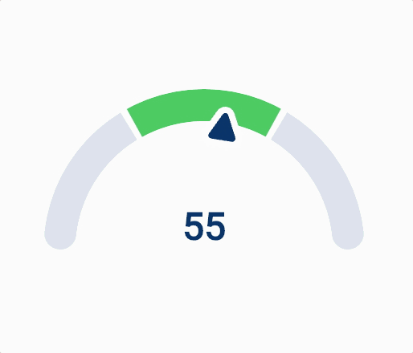
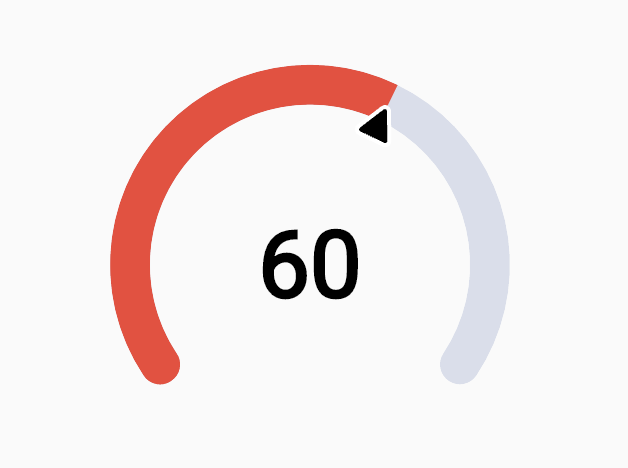
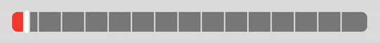

# Gauge indicator

> This is a fork of the original [`gauge_indicator` plugin](https://pub.dev/packages/gauge_indicator) as the [original repository](https://github.com/HTD-Health/gauge_indicator) was no longer exists.

Animated, highly customizable, open-source Flutter gauge indicator widgets. They use renderbox under the hood, thus ensuring high performance.

### Working web example of package [here](https://gauge-indicator.klyta.it/)



## Usage

It is as simple as defining a `RadialGauge` or an `AnimatedRadialGauge` widget in your widget tree.

## Code

```dart
/// Build method of your widget.
@override
Widget build(BuildContext context) {
  // Create animated radial gauge.
  // All arguments changes will be automatically animated.
  return AnimatedRadialGauge(
    /// The animation duration.
    duration: const Duration(milliseconds: 500),
    /// Gauge value.
    value: gaugeValue,
    /// Provide the [min] and [max] value for the [value] argument.
    min: 0,
    max: 100,
    /// Optionally, you can configure your gauge, providing additional
    /// styles and transformers.
    axis: GaugeAxis(
      /// Render the gauge as a 260-degree arc.
      degrees: 260,
      /// Display the green value progress.
      transformer: const GaugeAxisTransformer.progress(color: Colors.red),
      /// Set the background color and axis thickness.
      style: const GaugeAxisStyle(
        thickness: 20,
        background: Color(0xFFD9DEEB),
      ),
      /// Define the pointer that will indicate the progress.
      pointer: RoundedTrianglePointer(
        size: 20,
        backgroundColor: Colors.black,
        borderRadius: 2,
        border: const GaugePointerBorder(
          color: Colors.white,
          width: 2,
        ),
      ),
    ),
    /// You can also, define the child builder.
    /// This way you will build a value label, but you can use the widget of your choice.
    ///
    /// For non-value related widgets, take a look at the [child] parameter.
    builder: (context, child, value) => RadialGaugeLabel(
      value: value,
      style: const TextStyle(
        color: Colors.black,
        fontSize: 46,
        fontWeight: FontWeight.bold,
      ),
    ),
  );
}
```

## Output



# Linear Gauge


## Usage

It is as simple as defining a `LinearGauge` or an `AnimatedLinearGauge` widget in your widget tree.

## Code

```dart
@override
Widget build(BuildContext context) {
  // All property changes are animated
  return AnimatedLinearGauge(
    // Value of the gauge, for special cases we allow doubles
    value: 5,
    // Maximum value constrained to integer
    // for special edge case evasion
    max: 15,
    // color of the full width background rect
    backgroundColor:
        const Color.fromARGB(255, 132, 132, 132),
    // how much space do you want on the vertical axis of segments,
    // does not affect thumb height
    verticalSegmentMargin: 2.0,
    // how rounded are supposed to be the corners
    cornerRadius: 8.0,
    // width of separators dividing bar into individual segments
    separatorThickness: 2.0,
    // you can prevent widget from displaying dividers
    // when there is a lot of very thin segments,
    // if segment is thinner than this value, no separators will
    // be rendered
    minimumSegmentThickness: 8.0,
    // you can define many color ranges on the axis,
    // if you do not pass any semgent here
    // it will put one by default
    segments: const [
      LinearGaugeSegment(
        // you do not define ending value of the segment directly,
        // it will continue till next segment or to max value
        start: 0,
        color: Colors.red,
      ),
      LinearGaugeSegment(
        start: 5,
        color: Colors.green,
      ),
      LinearGaugeSegment(
        start: 10,
        color: Colors.blue,
      ),
    ],
    // duration of the animation
    duration: const Duration(milliseconds: 400),
    // curve implementation that you want to use
    curve: Curves.ease,
    // callback triggered when the animation ends
    onEnd: () {},
    // you can override default thumb style
    thumbStyle: const ThumbStyle(
      // infill color
      color: Colors.white,
      // width of the outer cutout mask
      strokeWidth: 2.0,
      // width of the infill
      thickness: 6.0,
    ),
  );
}
```

## Output


